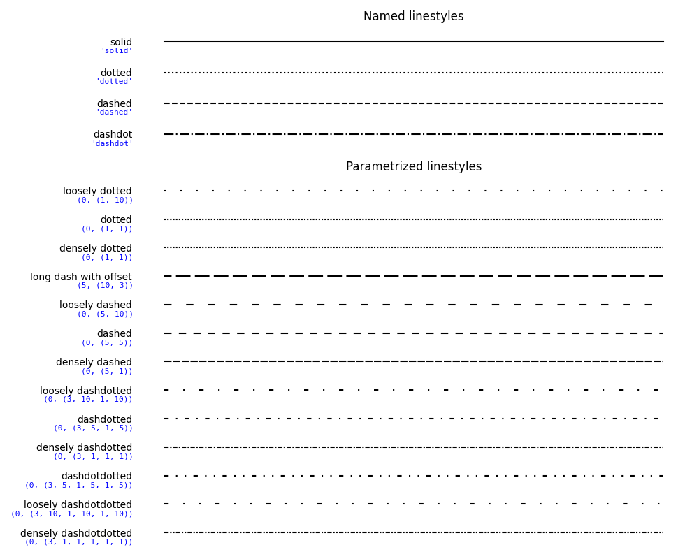
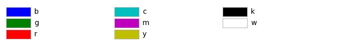
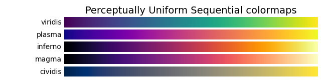
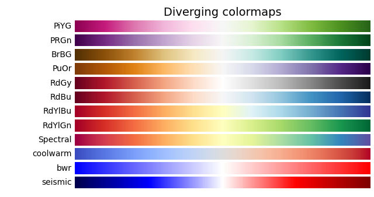
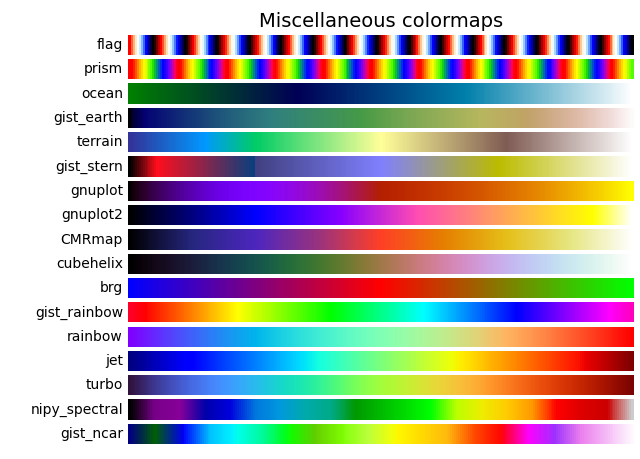
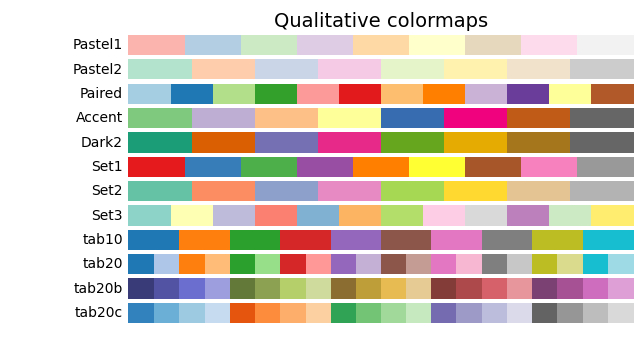
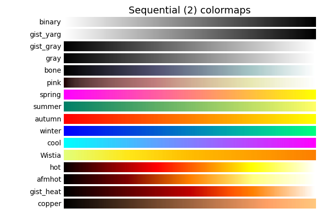

## [标识符-matplotlib.markers](https://matplotlib.org/stable/api/markers_api.html)

可以在绘图函数内通过`marker="marker name"`设置标识符，
标识符大小通过`markersize1=<16>`设置。下面是一些常用的`marker name`

|marker|symbol|description|
|-|-|-|
|"."||point|
|","||pixel|
|"o"||circle|
|"v"||triangle_down|
|"^"||triangle_up|
|"<"||triangle_left|
|">"||triangle_right|
|"1"||tri_down|
|"2"||tri_up|
|"3"||tri_left|
|"4"||tri_right|
|"8"||octagon|
|"s"||square|
|"p"||pentagon|
|"P"||plus(filled)|
|"*"||star|
|"h"||hexagon1|
|"H"||hexagon2|
|"+"||plus|
|"x"||x|
|"X"||x(filled)|
|"D"||diamond|
|"d"||thin_diamond|
|"\|"||vline|
|"_"||hline|

## [线形-linestyles](https://matplotlib.org/stable/gallery/lines_bars_and_markers/linestyles.html)

线型参数可以通过`linestyle="linestyle name"`设置，
线宽控制为`linewidth=<2>` or `lw=<2>`
常用的`linestyle name`为
+ `solid` 实线
+ `dotted` 点线
+ `dashed` 虚线
+ `dashdot` 点画线

线形还可以通过一个元组`(a, (b,c,...))`控制，其中
+ `a`: 线条的重复方式，通常为0
+ `b`: 线段长度
+ `c`: 空白长度
+ `d`: 下一段线长度(可选)
+ `e`: 下一段空白长度(可选)

下面是一些效果

## [颜色-matplotlib.colors](https://matplotlib.org/stable/gallery/color/named_colors.html)

颜色的控制参数为`color="color name"`，`color name`有很多形式，包括
1. 单字母：

2. 单词：

3. 六位十六进制颜色值

+ #ff0094
+ #ff0000
+ #000000

## [颜色映射-colormap](https://matplotlib.org/stable/gallery/color/colormap_reference.html)

颜色映射的控制参数为`cmap="colormap name"`，常用的`colormap name`为

+ `jet`: `ANSYS Fluent`默认选项
+ `coolwarm`: `Paraview`默认选项
+ `hot`: `Comsol`默认选项
+ `Greys` or `gray`: 灰度
+ `binary`: 黑白二值

